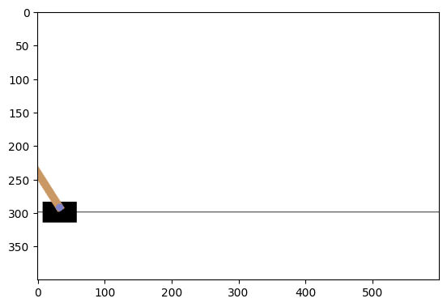

```python
import sys

!{sys.executable} --version
```

    Python 3.11.7


https://github.com/DeepReinforcementLearning/DeepReinforcementLearningInAction

## Sampling 


```python
from collections import deque

replay = deque(maxlen=10)
for i in range(20):
    replay.append(i)
replay
```


    deque([10, 11, 12, 13, 14, 15, 16, 17, 18, 19], maxlen=10)


```python
import random

random.sample(replay, 5)
```


    [16, 13, 15, 10, 19]


## Index


```python
replay = deque(maxlen=10)
for i in range(20):
    replay.append((i, i + 1, i + 2))
replay
```


    deque([(10, 11, 12),
           (11, 12, 13),
           (12, 13, 14),
           (13, 14, 15),
           (14, 15, 16),
           (15, 16, 17),
           (16, 17, 18),
           (17, 18, 19),
           (18, 19, 20),
           (19, 20, 21)],
          maxlen=10)


```python
sample = random.sample(replay, 5)
sample
```


    [(17, 18, 19), (13, 14, 15), (14, 15, 16), (11, 12, 13), (18, 19, 20)]


```python
import numpy as np

np.array(sample)[:, [0]]
```


    array([[17],
           [13],
           [14],
           [11],
           [18]])


## Torch


```python
import torch

a = torch.Tensor([[1, 2, 3]])
b = torch.Tensor([[4, 5, 6]])
torch.cat((a, b), 0)
```


    tensor([[1., 2., 3.],
            [4., 5., 6.]])


```python
torch.cat((a, b), 1)
```


    tensor([[1., 2., 3., 4., 5., 6.]])


```python
torch.flip(torch.arange(10), dims=(0,))
```


    tensor([9, 8, 7, 6, 5, 4, 3, 2, 1, 0])


```python
sample = torch.rand(3, 4)
sample
```


    tensor([[0.9277, 0.8176, 0.8868, 0.9252],
            [0.7309, 0.6490, 0.8936, 0.6641],
            [0.4022, 0.4231, 0.4521, 0.3200]])


```python
torch.flip(sample, dims=(0,))
```


    tensor([[0.4022, 0.4231, 0.4521, 0.3200],
            [0.7309, 0.6490, 0.8936, 0.6641],
            [0.9277, 0.8176, 0.8868, 0.9252]])


```python
torch.flip(sample, dims=(0, 1))
```


    tensor([[0.3200, 0.4521, 0.4231, 0.4022],
            [0.6641, 0.8936, 0.6490, 0.7309],
            [0.9252, 0.8868, 0.8176, 0.9277]])


```python
torch.flip(sample, dims=(1,))
```


    tensor([[0.9252, 0.8868, 0.8176, 0.9277],
            [0.6641, 0.8936, 0.6490, 0.7309],
            [0.3200, 0.4521, 0.4231, 0.4022]])


## Setting up gym


```python
# pip install gymnasium[classic-control]
import gymnasium as gym
import matplotlib.pyplot as plt
from IPython import display

%matplotlib inline

env = gym.make("CartPole-v1", render_mode="rgb_array")
env.reset()
img = plt.imshow(env.render())  # Just call this once.
for i in range(100):
    img.set_data(env.render())
    # plt.imshow(env.render())
    display.display(plt.gcf())
    display.clear_output(wait=True)
    env.step(env.action_space.sample())  # take a random action

env.close()
print("done")
```

    done


    

    


```python
from collections import namedtuple

Transition = namedtuple("Transition", ["state", "action", "reward"])

t = Transition("up", 1, 10)
t.state
```


    'up'


```python
transitions = [Transition("up", i, 10) for i in range(10)]
transitions
```


    [Transition(state='up', action=0, reward=10),
     Transition(state='up', action=1, reward=10),
     Transition(state='up', action=2, reward=10),
     Transition(state='up', action=3, reward=10),
     Transition(state='up', action=4, reward=10),
     Transition(state='up', action=5, reward=10),
     Transition(state='up', action=6, reward=10),
     Transition(state='up', action=7, reward=10),
     Transition(state='up', action=8, reward=10),
     Transition(state='up', action=9, reward=10)]


```python
batch = Transition(*zip(*transitions))
batch
```


    Transition(state=('up', 'up', 'up', 'up', 'up', 'up', 'up', 'up', 'up', 'up'), action=(0, 1, 2, 3, 4, 5, 6, 7, 8, 9), reward=(10, 10, 10, 10, 10, 10, 10, 10, 10, 10))


```python
batch.state
```


    ('up', 'up', 'up', 'up', 'up', 'up', 'up', 'up', 'up', 'up')


```python
batch.action
```


    (0, 1, 2, 3, 4, 5, 6, 7, 8, 9)


```python

```
