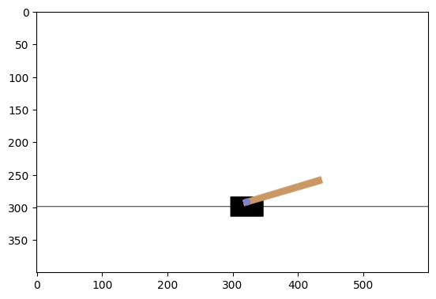

```python
import sys

!{sys.executable} --version
```

    Python 3.12.8


NOTE: Use `Shift+Tab` to show contextual tab.

https://github.com/DeepReinforcementLearning/DeepReinforcementLearningInAction

## Sampling 


```python
from collections import deque

replay = deque(maxlen=10)
for i in range(20):
    replay.append(i)

replay
```


    deque([10, 11, 12, 13, 14, 15, 16, 17, 18, 19], maxlen=10)


```python
import random

random.sample(replay, 5)
```


    [17, 13, 15, 12, 16]


## Index


```python
replay = deque(maxlen=10)
for i in range(20):
    replay.append((i, i + 1, i + 2))
replay
```


    deque([(10, 11, 12),
           (11, 12, 13),
           (12, 13, 14),
           (13, 14, 15),
           (14, 15, 16),
           (15, 16, 17),
           (16, 17, 18),
           (17, 18, 19),
           (18, 19, 20),
           (19, 20, 21)],
          maxlen=10)


```python
sample = random.sample(replay, 5)
sample
```


    [(17, 18, 19), (19, 20, 21), (15, 16, 17), (10, 11, 12), (16, 17, 18)]


```python
import numpy as np

np.array(sample)[:, [0]]
```


    array([[17],
           [19],
           [15],
           [10],
           [16]])


## Torch


```python
import torch

a = torch.Tensor([[1, 2, 3]])
b = torch.Tensor([[4, 5, 6]])
torch.cat((a, b), 0)
```


    tensor([[1., 2., 3.],
            [4., 5., 6.]])


```python
torch.cat((a, b), 1)
```


    tensor([[1., 2., 3., 4., 5., 6.]])


```python
torch.flip(torch.arange(10), dims=(0,))
```


    tensor([9, 8, 7, 6, 5, 4, 3, 2, 1, 0])


```python
sample = torch.rand(3, 4)
sample
```


    tensor([[0.8447, 0.5066, 0.2400, 0.5927],
            [0.7785, 0.8707, 0.1834, 0.7309],
            [0.0044, 0.6651, 0.6642, 0.0174]])


```python
torch.flip(sample, dims=(0,))
```


    tensor([[0.0044, 0.6651, 0.6642, 0.0174],
            [0.7785, 0.8707, 0.1834, 0.7309],
            [0.8447, 0.5066, 0.2400, 0.5927]])


```python
torch.flip(sample, dims=(0, 1))
```


    tensor([[0.0174, 0.6642, 0.6651, 0.0044],
            [0.7309, 0.1834, 0.8707, 0.7785],
            [0.5927, 0.2400, 0.5066, 0.8447]])


```python
torch.flip(sample, dims=(1,))
```


    tensor([[0.5927, 0.2400, 0.5066, 0.8447],
            [0.7309, 0.1834, 0.8707, 0.7785],
            [0.0174, 0.6642, 0.6651, 0.0044]])


## Setting up gym


```python
# pip install gymnasium[classic-control]
import gymnasium as gym
import matplotlib.pyplot as plt
from IPython import display

%matplotlib inline

env = gym.make("CartPole-v1", render_mode="rgb_array")
env.reset()
img = plt.imshow(env.render())  # Just call this once.
for i in range(100):
    img.set_data(env.render())
    # plt.imshow(env.render())
    display.display(plt.gcf())
    display.clear_output(wait=True)
    env.step(env.action_space.sample())  # take a random action

env.close()
print("done")
```

    done


    

    


```python
from collections import namedtuple

Transition = namedtuple("Transition", ["state", "action", "reward"])

t = Transition("up", 1, 10)
t.state
```


    'up'


```python
transitions = [Transition("up", i, 10) for i in range(10)]
transitions
```


    [Transition(state='up', action=0, reward=10),
     Transition(state='up', action=1, reward=10),
     Transition(state='up', action=2, reward=10),
     Transition(state='up', action=3, reward=10),
     Transition(state='up', action=4, reward=10),
     Transition(state='up', action=5, reward=10),
     Transition(state='up', action=6, reward=10),
     Transition(state='up', action=7, reward=10),
     Transition(state='up', action=8, reward=10),
     Transition(state='up', action=9, reward=10)]


```python
batch = Transition(*zip(*transitions))
batch
```


    Transition(state=('up', 'up', 'up', 'up', 'up', 'up', 'up', 'up', 'up', 'up'), action=(0, 1, 2, 3, 4, 5, 6, 7, 8, 9), reward=(10, 10, 10, 10, 10, 10, 10, 10, 10, 10))


```python
batch.state
```


    ('up', 'up', 'up', 'up', 'up', 'up', 'up', 'up', 'up', 'up')


```python
batch.action
```


    (0, 1, 2, 3, 4, 5, 6, 7, 8, 9)


```python
import numpy as np
import torch
```


```python
n = np.random.rand(2, 3)
n, torch.from_numpy(n)
```


    (array([[0.86834196, 0.71379203, 0.00695944],
            [0.03460631, 0.71754087, 0.01358655]]),
     tensor([[0.8683, 0.7138, 0.0070],
             [0.0346, 0.7175, 0.0136]], dtype=torch.float64))


## Torch Operations


### Torch Squeeze

`torch.squeeze` removes all dimension of 1 from the tensor.


```python
import torch

t = torch.rand(1, 2, 1, 2)
t.shape
```


    torch.Size([1, 2, 1, 2])


```python
s = torch.squeeze(t)
s, s.shape
```


    (tensor([[0.3566, 0.7225],
             [0.4224, 0.6005]]),
     torch.Size([2, 2]))


```python
# Remove from first dimension
s = torch.squeeze(t, 0)
s, s.shape
```


    (tensor([[[0.3566, 0.7225]],
     
             [[0.4224, 0.6005]]]),
     torch.Size([2, 1, 2]))


```python
# Remove from second dimension (which is not 1, so it is not removed)
s = torch.squeeze(t, 1)
s, s.shape
```


    (tensor([[[[0.3566, 0.7225]],
     
              [[0.4224, 0.6005]]]]),
     torch.Size([1, 2, 1, 2]))


```python
# Remove from third dimension (which is not 1, so it is not removed)
s = torch.squeeze(t, 2)
s, s.shape
```


    (tensor([[[0.3566, 0.7225],
              [0.4224, 0.6005]]]),
     torch.Size([1, 2, 2]))


```python
# Remove from fourth dimension
s = torch.squeeze(t, 3)
s, s.shape
```


    (tensor([[[[0.3566, 0.7225]],
     
              [[0.4224, 0.6005]]]]),
     torch.Size([1, 2, 1, 2]))


```python
# Remove from third dimension
try:
    s = torch.squeeze(t, 4)
except IndexError as e:
    print(type(e), e)
```

    <class 'IndexError'> Dimension out of range (expected to be in range of [-4, 3], but got 4)


### Torch Unsqueeze

The opposite of `torch.squeeze`, adds an additional dimension at the specified index. 
Can we use `torch.view` for this?


```python
# (2, 3)
# Start with an array []
# There are two more arrays in it, [[], []]
# And each array has 3 cols, [[1,2,3], [4,5,6]]
t = torch.rand(2, 3)
t, t.shape
```


    (tensor([[0.4083, 0.7886, 0.8799],
             [0.3980, 0.1163, 0.0064]]),
     torch.Size([2, 3]))


```python
# unsqueeze(2,3, dim=0) = (1, 2, 3)
# Start with an array []
# Add a 1-dim array inside: [[]]
# There are two more arrays in it, [[[], []]]
# And each array has 3 cols, [[[1,2,3], [4,5,6]]]
s = torch.unsqueeze(t, 0)
s, s.shape
```


    (tensor([[[0.4083, 0.7886, 0.8799],
              [0.3980, 0.1163, 0.0064]]]),
     torch.Size([1, 2, 3]))


```python
# unsqueeze(2,3, dim=1) = (2, 1, 3)
# Start with an array []
# Add a 2-dim array inside: [[], []]
# Each has 1 array, [[[]], [[]]]
# And each array has 3 cols, [[[1,2,3]], [[1,2,3]]]
s = torch.unsqueeze(t, 1)
s, s.shape
```


    (tensor([[[0.4083, 0.7886, 0.8799]],
     
             [[0.3980, 0.1163, 0.0064]]]),
     torch.Size([2, 1, 3]))


```python
s[0][0]
```


    tensor([0.4083, 0.7886, 0.8799])


```python
t.view((2, 1, 3))
```


    tensor([[[0.4083, 0.7886, 0.8799]],
    
            [[0.3980, 0.1163, 0.0064]]])


```python
# unsqueeze(2,3, dim=2) = (2, 3, 1)
# Start with an array []
# Add a 2-dim array inside: [[], []]
# Each has 3 array, [[[], [], []], [[], [], []]]
# And each array has 1 col, [[[1], [2], [3]], [[4], [5], [6]]]
s = torch.unsqueeze(t, 2)  # same as dim=-1
s, s.shape
```


    (tensor([[[0.4083],
              [0.7886],
              [0.8799]],
     
             [[0.3980],
              [0.1163],
              [0.0064]]]),
     torch.Size([2, 3, 1]))


```python
s[0][0]
```


    tensor([0.4083])


```python
t.view((2, 3, 1))
```


    tensor([[[0.4083],
             [0.7886],
             [0.8799]],
    
            [[0.3980],
             [0.1163],
             [0.0064]]])


### Torch Stack

`torch.stack` operation is basically `torch.unsqueeze` followed by `torch.cat` at the given dimension.


```python
import torch

t = torch.rand((2, 3))
t, t.shape
```


    (tensor([[0.3298, 0.9315, 0.1492],
             [0.1927, 0.8380, 0.2639]]),
     torch.Size([2, 3]))


```python
t = torch.Tensor([[1, 2, 3], [4, 5, 6]])
t, t.shape
```


    (tensor([[1., 2., 3.],
             [4., 5., 6.]]),
     torch.Size([2, 3]))


```python
t[0], t[1]
```


    (tensor([1., 2., 3.]), tensor([4., 5., 6.]))


```python
# (2, 3) + (2, 3)
# unsqueeze(2, 3, dim=0) = (1, 2, 3)
# cat((1,2,3), (1,2,3), dim=0) = (2, 2, 6)
a = torch.stack((t, t))
a, a.shape
```


    (tensor([[[1., 2., 3.],
              [4., 5., 6.]],
     
             [[1., 2., 3.],
              [4., 5., 6.]]]),
     torch.Size([2, 2, 3]))


```python
# unsqueeze(2, 3, dim=1) = (2, 1, 3)
# cat((2,1,3), (2,1,3), dim=1) = (2, 2, 6)
b = torch.stack((t, t), dim=1)
b, b.shape
```


    (tensor([[[1., 2., 3.],
              [1., 2., 3.]],
     
             [[4., 5., 6.],
              [4., 5., 6.]]]),
     torch.Size([2, 2, 3]))


```python
# unsqueeze(2, 3, dim=2) = (2, 3, 1)
# cat((2,3,1), (2,3,1), dim=1) = (2, 3, 2)
c = torch.stack((t, t), dim=2)
c, c.shape
```


    (tensor([[[1., 1.],
              [2., 2.],
              [3., 3.]],
     
             [[4., 4.],
              [5., 5.],
              [6., 6.]]]),
     torch.Size([2, 3, 2]))


```python
print(a[0])
print(a[1])
```

    tensor([[1., 2., 3.],
            [4., 5., 6.]])
    tensor([[1., 2., 3.],
            [4., 5., 6.]])


```python
print(b[0])
print(b[1])
```

    tensor([[1., 2., 3.],
            [1., 2., 3.]])
    tensor([[4., 5., 6.],
            [4., 5., 6.]])


```python
a = torch.stack((t, t, t))
b = torch.stack((t, t, t), dim=1)
c = torch.stack((t, t, t), dim=2)
print(a, a.shape)
print(b, b.shape)
print(c, c.shape)
```

    tensor([[[1., 2., 3.],
             [4., 5., 6.]],
    
            [[1., 2., 3.],
             [4., 5., 6.]],
    
            [[1., 2., 3.],
             [4., 5., 6.]]]) torch.Size([3, 2, 3])
    tensor([[[1., 2., 3.],
             [1., 2., 3.],
             [1., 2., 3.]],
    
            [[4., 5., 6.],
             [4., 5., 6.],
             [4., 5., 6.]]]) torch.Size([2, 3, 3])
    tensor([[[1., 1., 1.],
             [2., 2., 2.],
             [3., 3., 3.]],
    
            [[4., 4., 4.],
             [5., 5., 5.],
             [6., 6., 6.]]]) torch.Size([2, 3, 3])


### Torch Cat


```python
a = torch.cat((t, t))  # (2,3), (2,3) = (4,3), adds the 0 dim
b = torch.cat((t, t), dim=1)  # (2, 3), (2,3) = (2, 6), adds the 1 dim
print(a, a.shape)
print(b, b.shape)
```

    tensor([[1., 2., 3.],
            [4., 5., 6.],
            [1., 2., 3.],
            [4., 5., 6.]]) torch.Size([4, 3])
    tensor([[1., 2., 3., 1., 2., 3.],
            [4., 5., 6., 4., 5., 6.]]) torch.Size([2, 6])


```python
a = torch.cat((t, t, t))
b = torch.cat((t, t, t), dim=1)
print(a, a.shape)
print(b, b.shape)
```

    tensor([[1., 2., 3.],
            [4., 5., 6.],
            [1., 2., 3.],
            [4., 5., 6.],
            [1., 2., 3.],
            [4., 5., 6.]]) torch.Size([6, 3])
    tensor([[1., 2., 3., 1., 2., 3., 1., 2., 3.],
            [4., 5., 6., 4., 5., 6., 4., 5., 6.]]) torch.Size([2, 9])


### Torch Gather

The output is actually quite simple. It follows the size of the `index` tensor.

For each dimension, just replace the dim of the `index` tensor:

- dim 0: `input[index][j][k]`
- dim 1: `input[i][index][k]`
- dim 2: `input[i][j][index]`


```python
t = torch.Tensor([[1, 2, 3], [4, 5, 6]])
t, t.shape
```


    (tensor([[1., 2., 3.],
             [4., 5., 6.]]),
     torch.Size([2, 3]))


```python
# We have three rows to gather
# Take for example the first index row: [0, 1, 1]
# Each position is (0, 0), (0, 1), (0, 2)
# Replace each value at 0 with the index value [0, 1, 1]
# Each position is now (0, 0), (1, 1), (1, 2)
# Take the input value
#
# The max number of rows for index is unlimited, but the max number of cols must match the input col, which is 3.
# If tensor shape is (2, 3)
# Then index shape can be (n, 3) for dim 0
index = torch.Tensor([[0, 1, 1], [1, 1, 0], [1, 0, 0], [0, 0, 0]]).long()
print(index.shape)
torch.gather(t, 0, index)
```

    torch.Size([4, 3])


    tensor([[1., 5., 6.],
            [4., 5., 3.],
            [4., 2., 3.],
            [1., 2., 3.]])


```python
# We have two rows to gather
# Take for example the first index row: [1, 2, 0, 1]
# Each position is (0, 0), (0, 1), (0, 2), (0, 3)
# Replace each value at 1 with the index value [1, 2, 0, 1]
# Each position is now (0, 1), (0, 2), (0, 0), (0, 1)
# Take the input value
#
# The max number of row is limited to the number of rows, but the max number of cols is unlimited.
# If tensor shape is (2, 3)
# Then index shape can be (2, n) for dim 1
index = torch.Tensor([[1, 2, 0, 1], [0, 1, 2, 1]]).long()
print(index.shape)
torch.gather(t, 1, index)
```

    torch.Size([2, 4])


    tensor([[2., 3., 1., 2.],
            [4., 5., 6., 5.]])


```python
import random

random.randint(0, 1)  # Generates between lo (inclusive) and hi (inclusive)
```


    1


```python
np.random.randint(0, 1)  # Generates between lo (inclusive) and hi (exclusive)
```


    0


## One Hot Encode


```python
import torch
import torch.nn.functional as F

t = torch.arange(0, 6)

print(t)
F.one_hot(t)
```

    tensor([0, 1, 2, 3, 4, 5])


    tensor([[1, 0, 0, 0, 0, 0],
            [0, 1, 0, 0, 0, 0],
            [0, 0, 1, 0, 0, 0],
            [0, 0, 0, 1, 0, 0],
            [0, 0, 0, 0, 1, 0],
            [0, 0, 0, 0, 0, 1]])


```python
F.one_hot(t, num_classes=10)
```


    tensor([[1, 0, 0, 0, 0, 0, 0, 0, 0, 0],
            [0, 1, 0, 0, 0, 0, 0, 0, 0, 0],
            [0, 0, 1, 0, 0, 0, 0, 0, 0, 0],
            [0, 0, 0, 1, 0, 0, 0, 0, 0, 0],
            [0, 0, 0, 0, 1, 0, 0, 0, 0, 0],
            [0, 0, 0, 0, 0, 1, 0, 0, 0, 0]])


```python
F.one_hot(torch.tensor(0), num_classes=3)
```


    tensor([1, 0, 0])


```python
F.one_hot(torch.tensor(1), num_classes=3)
```


    tensor([0, 1, 0])


```python
F.one_hot(torch.tensor(2), num_classes=3)
```


    tensor([0, 0, 1])


```python
# RuntimeError: Class values must be smaller than num_classes.
# F.one_hot(torch.tensor(3), num_classes=3)
```


```python
t.view((3, 2))
```


    tensor([[0, 1],
            [2, 3],
            [4, 5]])


```python
t.view((2, 3))
```


    tensor([[0, 1, 2],
            [3, 4, 5]])


```python
t.view((1, 2, 3))
```


    tensor([[[0, 1, 2],
             [3, 4, 5]]])


```python
t.view((3, 2, 1))
```


    tensor([[[0],
             [1]],
    
            [[2],
             [3]],
    
            [[4],
             [5]]])


## Single value


```python
a_list = torch.Tensor([1])
an_item = torch.tensor(1)
print(a_list)
print(an_item)
```

    tensor([1.])
    tensor(1)


```python
a_list.item(), an_item.item()
```


    (1.0, 1)


```python
detached = a_list.detach()
detached
```


    tensor([1.])


```python
detached[0] = 2
```


```python
detached
```


    tensor([2.])


