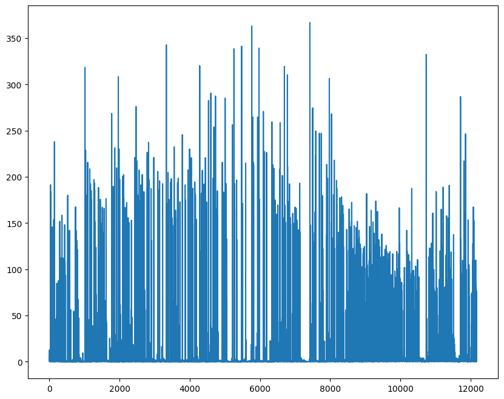

# Deep Q-Network

## GridWorld


```python
from gridworld.gridworld import GridWorld

env = GridWorld(4)
env.reset(seed=42)
env.render()
```


    [['W', '.', '.', '.'],
     ['.', 'P', '.', '.'],
     ['.', '+', '.', '.'],
     ['-', '.', '.', '.']]


```python
# 0: up, 1: down, 2: left, 3: right
ob, reward, terminated, truncated, info = env.step(0)
print("reward: {} | terminated: {}".format(reward, terminated))
env.render()
```

    reward: -1 | terminated: False


    [['W', 'P', '.', '.'],
     ['.', '.', '.', '.'],
     ['.', '+', '.', '.'],
     ['-', '.', '.', '.']]


```python
ob, reward, terminated, truncated, info = env.step(1)
print("reward: {} | terminated: {}".format(reward, terminated))
env.render()
```

    reward: -1 | terminated: False


    [['W', '.', '.', '.'],
     ['.', 'P', '.', '.'],
     ['.', '+', '.', '.'],
     ['-', '.', '.', '.']]


```python
ob, reward, terminated, truncated, info = env.step(1)
print("reward: {} | terminated: {}".format(reward, terminated))
env.render()
```

    reward: 10 | terminated: True


    [['W', '.', '.', '.'],
     ['.', '.', '.', '.'],
     ['.', 'P', '.', '.'],
     ['-', '.', '.', '.']]


```python
# Each row represents the index of the pieces on the tile in the order:
# player, goal, pit, wall
env.observation
```


    [[[0, 0, 0, 0], [0, 0, 0, 0], [0, 1, 0, 0], [0, 0, 0, 0]],
     [[0, 0, 0, 0], [0, 0, 0, 0], [0, 1, 0, 0], [0, 0, 0, 0]],
     [[0, 0, 0, 0], [0, 0, 0, 0], [0, 0, 0, 0], [1, 0, 0, 0]],
     [[1, 0, 0, 0], [0, 0, 0, 0], [0, 0, 0, 0], [0, 0, 0, 0]]]


```python
import numpy as np

assert np.array(env.observation).shape == (4, 4, 4)
```

## Neural Network Q Function


```python
import random

import matplotlib.pyplot as plt
import numpy as np
import torch
from gridworld.gridworld import GridWorld
from tqdm.notebook import tqdm, trange

plt.rcParams["figure.figsize"] = (10, 8)

# mps is slow ...
# device = (
#     "cuda"
#     if torch.cuda.is_available()
#     else "mps" if torch.backends.mps.is_available() else "cpu"
# )
device = "cpu"
device
```


    'cpu'


```python
def make_model():
    model = torch.nn.Sequential(
        # Input is our gridworld state, a 1x64 grid representation.
        torch.nn.Linear(64, 150),
        torch.nn.ReLU(),
        torch.nn.Linear(150, 100),
        torch.nn.ReLU(),
        # Output is the expected rewards for each arm: 0: up, 1: down, 2: left, 3: right
        torch.nn.Linear(100, 4),
    )
    return model
```


```python
model = make_model().to(device)
next(model.parameters()).device
```


    device(type='cpu')


```python
criterion = torch.nn.MSELoss()
optimizer = torch.optim.Adam(model.parameters(), lr=1e-3)
```


```python
def dqn(model, optimizer, epoch=1000, epsilon=1.0, gamma=0.9, seed=None):
    noise = lambda: (torch.rand(1, 64) / 64).to(device)
    losses = []
    for i in trange(epoch):
        env = GridWorld(size=4)
        env.reset(seed=seed)  # Static board.

        # Initial state, with noise.
        observation = env.observation
        while True:
            state = torch.Tensor(observation).to(device).view(-1, 64) + noise()
            q_val = model(state)
            if np.random.random() < epsilon:  # Exploration
                action = torch.randint(4, (1,)).item()
            else:
                action = torch.argmax(q_val, dim=1).item()
            observation, reward, terminated, _truncated, _info = env.step(action)
            if not terminated:
                state = torch.Tensor(observation).to(device).view(-1, 64) + noise()
                with torch.no_grad():
                    next_q_val = model(state)
                max_q = torch.max(next_q_val)
                reward = reward + gamma * max_q

            y_pred = torch.Tensor([reward]).to(device)
            y_true = q_val[:, action]
            loss = criterion(y_pred, y_true)
            optimizer.zero_grad()
            loss.backward()
            optimizer.step()

            losses.append(loss.item())
            if terminated:
                break
        if epsilon > 0.1:
            epsilon -= 1 / epoch
    return losses
```


```python
losses = dqn(model, optimizer, epoch=1000, seed=33)  # Static board
plt.plot(np.arange(len(losses)), losses);
```


      0%|          | 0/1000 [00:00<?, ?it/s]


    

    


```python
def test_dqn(model, epoch=32):
    env = GridWorld(size=4)
    env.reset(seed=33)  # Static board.

    # Initial state, with noise.
    observation = env.observation
    for i in range(epoch):
        print("Step: {}".format(i))
        print("\n".join(list(map(lambda row: "".join(row), env.render()))))
        print()
        state = torch.Tensor(observation).to(device).view(-1, 64)
        with torch.no_grad():
            q_val = model(state)
        action = torch.argmax(q_val, dim=1).item()
        observation, reward, terminated, _truncated, _info = env.step(action)
        if terminated:
            print("DONE")
            break
```


```python
test_dqn(model)
```

    Step: 0
    ....
    .+-.
    ...P
    ...W
    
    Step: 1
    ....
    .+-.
    ..P.
    ...W
    
    Step: 2
    ....
    .+-.
    .P..
    ...W
    
    DONE


```python
losses = dqn(model, optimizer, epoch=1000, seed=None)  # Random board
plt.plot(np.arange(len(losses)), losses);
```


      0%|          | 0/1000 [00:00<?, ?it/s]


    

    


## Experience Replay


```python
from collections import deque


def dqn_experience_replay(model, optimizer, epochs=1000, gamma=0.9, epsilon=1.0):
    replay = deque(maxlen=1000)
    batch_size = 200
    max_moves = 50
    losses = []
    noise = lambda: (torch.rand(1, 64) / 64).to(device)

    for _ in trange(epochs):
        env = GridWorld(4)
        env.reset(seed=None)  # Random state

        observation = env.observation
        for _ in range(max_moves):
            state = torch.Tensor(observation).to(device).view(-1, 64) + noise()
            q_val = model(state)
            if np.random.random() < epsilon:
                action = torch.randint(4, (1,)).item()
            else:
                action = torch.argmax(q_val, dim=1).item()
            observation, reward, terminated, _truncated, _info = env.step(action)
            replay.append(
                (
                    state,
                    action,
                    reward,
                    torch.Tensor(observation).to(device).view(-1, 64),
                    terminated,
                )
            )

            if len(replay) > batch_size:
                # Experience replay.
                batch = random.sample(replay, batch_size)
                (
                    state1_batch,
                    action_batch,
                    reward_batch,
                    state2_batch,
                    terminated_batch,
                ) = list(zip(*batch))
                state1_batch = torch.cat(state1_batch)
                action_batch = torch.Tensor(action_batch).to(device)
                reward_batch = torch.Tensor(reward_batch).to(device)
                state2_batch = torch.cat(state2_batch)
                terminated_batch = torch.Tensor(terminated_batch).to(device)
                q_val = model(state1_batch)
                with torch.no_grad():
                    q_val_next = model(state2_batch)
                y_pred = (
                    reward_batch
                    + gamma * (1 - terminated_batch) * torch.max(q_val_next, dim=1)[0]
                )
                y_true = q_val.gather(
                    dim=1, index=action_batch.unsqueeze(dim=1).long()
                ).squeeze()
                loss = criterion(y_pred, y_true)
                optimizer.zero_grad()
                loss.backward()
                optimizer.step()
                losses.append(loss.item())
            if terminated:
                break
        if epsilon > 0.1:
            epsilon -= 1 / epochs
    return losses
```


```python
# The first item is the values, the second is the index
torch.max(torch.Tensor([[1, 2, 3], [3, 5, 6]]), dim=1)
```


    torch.return_types.max(
    values=tensor([3., 6.]),
    indices=tensor([2, 2]))


```python
torch.max(torch.Tensor([[1, 2, 3], [3, 5, 6]]), dim=0)
```


    torch.return_types.max(
    values=tensor([3., 5., 6.]),
    indices=tensor([1, 1, 1]))


```python
torch.max(torch.Tensor([[1, 2, 3], [3, 5, 6]]))
```


    tensor(6.)


```python
model = make_model().to(device)
criterion = torch.nn.MSELoss()
optimizer = torch.optim.Adam(model.parameters(), lr=1e-3)
```


```python
losses = dqn_experience_replay(model, optimizer, epochs=5000)
plt.plot(np.arange(len(losses)), losses)
```


      0%|          | 0/5000 [00:00<?, ?it/s]


    [<matplotlib.lines.Line2D at 0x168ef4c50>]


    

    


```python
def test_dqn_experience_replay(model, epoch=1000, max_moves=50):
    wins = 0
    loss = 0
    limbo = 0
    for _ in trange(epoch):
        env = GridWorld(4)
        env.reset(seed=None)  # Random state

        observation = env.observation
        for _ in range(max_moves):
            state = torch.Tensor(observation).to(device).view(-1, 64)
            q_val = model(state)
            action = torch.argmax(q_val, dim=1).item()
            observation, reward, terminated, _truncated, _info = env.step(action)
            if terminated:
                break
        if reward == 10:
            wins += 1
        if reward == -10:
            loss += 1
        if reward == -1:
            print()
            print(np.array(env.render()))
            limbo += 1
    return wins, loss, limbo
```


```python
win, loss, limbo = test_dqn_experience_replay(model, max_moves=50)
win, loss, limbo
```


      0%|          | 0/1000 [00:00<?, ?it/s]


    
    [['-' '.' '.' '.']
     ['.' '.' '.' '.']
     ['.' '.' '.' '.']
     ['P' '.' '+' '.']]
    
    [['W' '+' '.' '.']
     ['.' '-' '.' '.']
     ['.' '.' 'P' '.']
     ['.' '.' '.' '.']]
    
    [['.' 'P' '.' '.']
     ['.' '-' '.' '+']
     ['W' '.' '.' '.']
     ['.' '.' '.' '.']]
    
    [['.' 'P' 'W' '.']
     ['+' '-' '.' '.']
     ['.' '.' '.' '.']
     ['.' '.' '.' '.']]
    
    [['.' 'P' '.' '.']
     ['.' '-' '.' '+']
     ['W' '.' '.' '.']
     ['.' '.' '.' '.']]
    
    [['W' '+' '.' '.']
     ['.' '-' '.' '.']
     ['.' '.' 'P' '.']
     ['.' '.' '.' '.']]
    
    [['.' '.' '.' '.']
     ['.' '+' '-' 'P']
     ['W' '.' '.' '.']
     ['.' '.' '.' '.']]
    
    [['.' '+' '.' '.']
     ['.' '.' '.' '.']
     ['.' '-' 'W' '.']
     ['.' 'P' '.' '.']]
    
    [['W' '+' '.' '.']
     ['.' '.' '.' '.']
     ['.' '-' '.' '.']
     ['.' 'P' '.' '.']]


    (990, 1, 9)


## Target Network


```python
import copy

model = make_model().to(device)
# https://discuss.pytorch.org/t/are-there-any-recommended-methods-to-clone-a-model/483/4
target = copy.deepcopy(model)
target.load_state_dict(model.state_dict())

criterion = torch.nn.MSELoss()
optimizer = torch.optim.Adam(model.parameters(), lr=1e-3)
```


```python
def dqn_target_network(
    model, target, optimizer, sync_freq=500, epochs=5000, epsilon=1.0, gamma=0.9
):
    losses = []
    mem_size = 1000
    batch_size = 200
    replay = deque(maxlen=mem_size)
    max_moves = 50
    noise = lambda: (torch.rand(1, 64) / 64).to(device)

    freq = 0

    for _ in trange(epochs):
        env = GridWorld(4)
        env.reset(seed=None)  # Random state

        observation = env.observation
        for _ in range(max_moves):
            state = torch.Tensor(observation).to(device).view(-1, 64) + noise()
            q_val = model(state)
            if np.random.random() < epsilon:
                action = torch.randint(4, (1,)).item()
            else:
                action = torch.argmax(q_val, dim=1).item()

            observation, reward, terminated, _truncated, _info = env.step(action)
            replay.append(
                (
                    state,
                    action,
                    reward,
                    torch.Tensor(observation).to(device).view(-1, 64),
                    terminated,
                )
            )
            if len(replay) > batch_size:
                batch = random.sample(replay, batch_size)
                (
                    state1_batch,
                    action_batch,
                    reward_batch,
                    state2_batch,
                    terminated_batch,
                ) = list(zip(*batch))
                state1_batch = torch.cat(state1_batch)
                action_batch = torch.Tensor(action_batch).to(device)
                reward_batch = torch.Tensor(reward_batch).to(device)
                state2_batch = torch.cat(state2_batch)
                terminated_batch = torch.Tensor(terminated_batch).to(device)

                q_val = model(state1_batch)
                with torch.no_grad():
                    q_val_next = target(state2_batch)
                y_pred = (
                    reward_batch
                    + gamma * (1 - terminated_batch) * torch.max(q_val_next, dim=1)[0]
                )
                y_true = q_val.gather(
                    dim=1, index=action_batch.unsqueeze(dim=1).long()
                ).squeeze()
                loss = criterion(y_pred, y_true)
                optimizer.zero_grad()
                loss.backward()
                optimizer.step()
                losses.append(loss.item())

                if freq % sync_freq == 0:
                    target.load_state_dict(model.state_dict())
                if terminated:
                    break
            freq += 1
        if epsilon > 0.1:
            epsilon -= 1 / epochs
    return losses
```


```python
losses = dqn_target_network(model, target, optimizer, epochs=5000)
plt.plot(np.arange(len(losses)), losses);
```


      0%|          | 0/5000 [00:00<?, ?it/s]


    

    


```python
def test_dqn_target_network(model, epoch=1000, max_moves=50):
    wins = 0
    loss = 0
    limbo = 0
    for _ in trange(epoch):
        env = GridWorld(4)
        env.reset(seed=None)  # Random state

        observation = env.observation
        for _ in range(max_moves):
            state = torch.Tensor(observation).to(device).view(-1, 64)
            q_val = model(state)
            action = torch.argmax(q_val, dim=1).item()
            observation, reward, terminated, _truncated, _info = env.step(action)
            if terminated:
                break
        if reward == 10:
            wins += 1
        if reward == -10:
            loss += 1
        if reward == -1:
            print()
            print(np.array(env.render()))
            limbo += 1
    return wins, loss, limbo
```


```python
wins, loss, limbo = test_dqn_target_network(model)
wins, loss, limbo
```


      0%|          | 0/1000 [00:00<?, ?it/s]


    
    [['W' '.' '.' '+']
     ['.' '.' '.' '-']
     ['.' '.' '.' '.']
     ['.' '.' 'P' '.']]
    
    [['.' '.' '.' '+']
     ['.' '.' '.' '-']
     ['.' '.' 'W' '.']
     ['.' '.' 'P' '.']]
    
    [['W' '.' '.' '.']
     ['P' '-' '.' '.']
     ['.' '.' '.' '.']
     ['.' '.' '+' '.']]
    
    [['-' '.' '.' '.']
     ['.' '.' 'P' '.']
     ['.' '.' 'W' '.']
     ['+' '.' '.' '.']]
    
    [['W' '.' '.' '+']
     ['.' '.' '.' '-']
     ['.' '.' '.' '.']
     ['.' '.' 'P' '.']]
    
    [['.' '.' '.' '+']
     ['.' '.' '.' '-']
     ['.' '.' '.' '.']
     ['W' '.' 'P' '.']]
    
    [['.' '.' '.' '+']
     ['.' '.' '.' '-']
     ['.' '.' 'W' '.']
     ['.' '.' 'P' '.']]


    (993, 0, 7)


